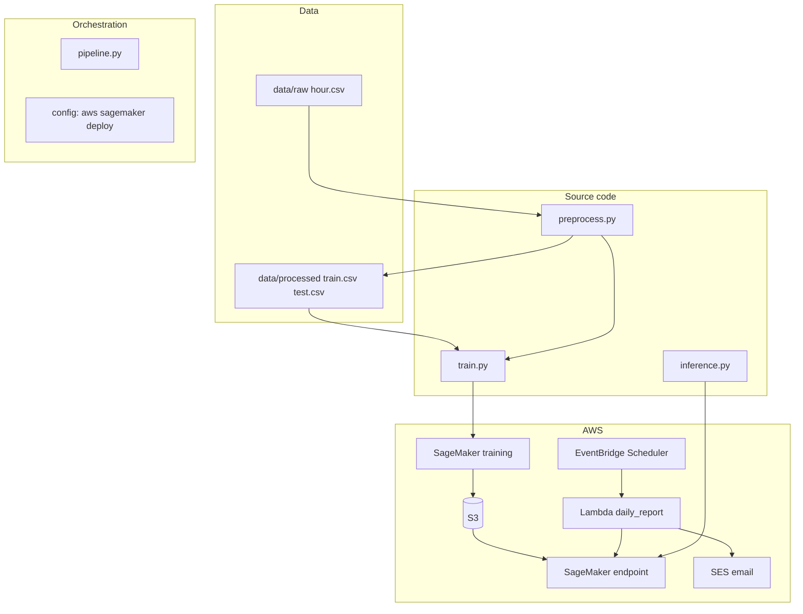
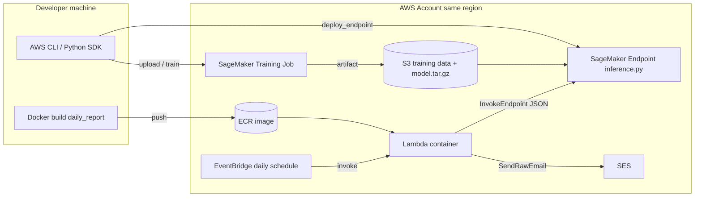
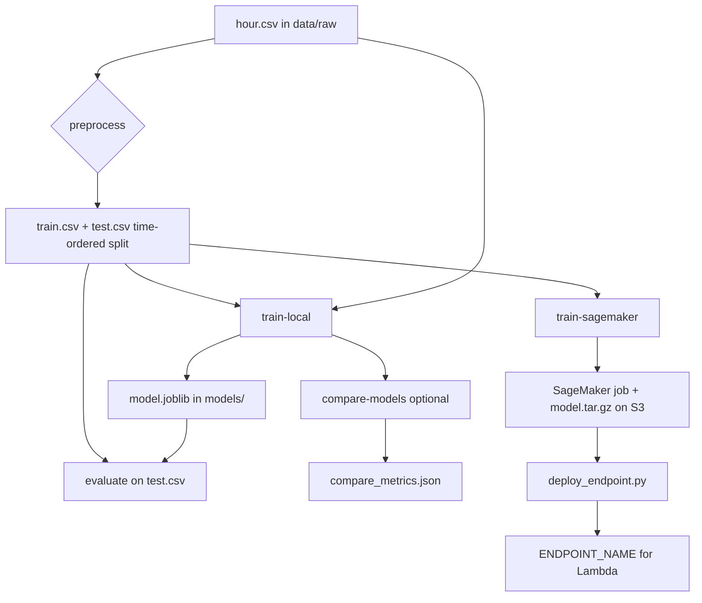
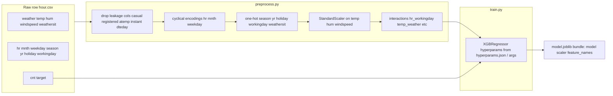
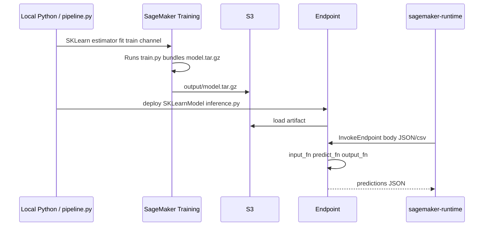
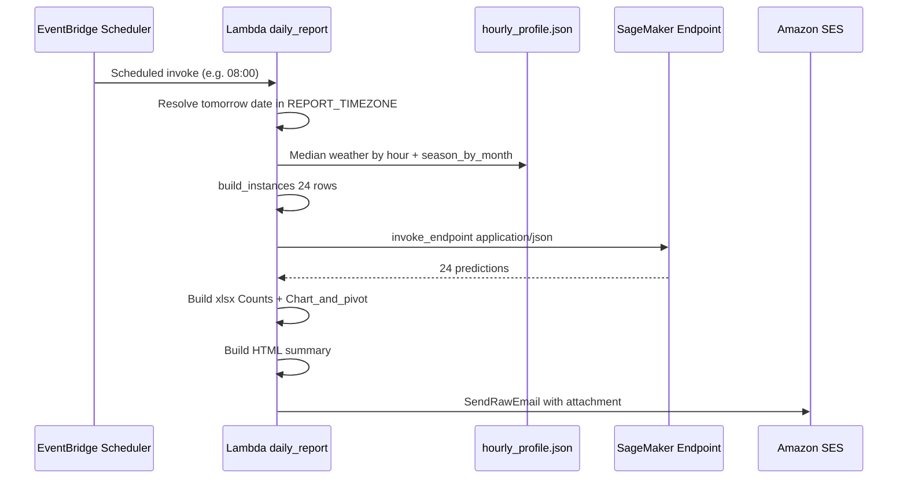
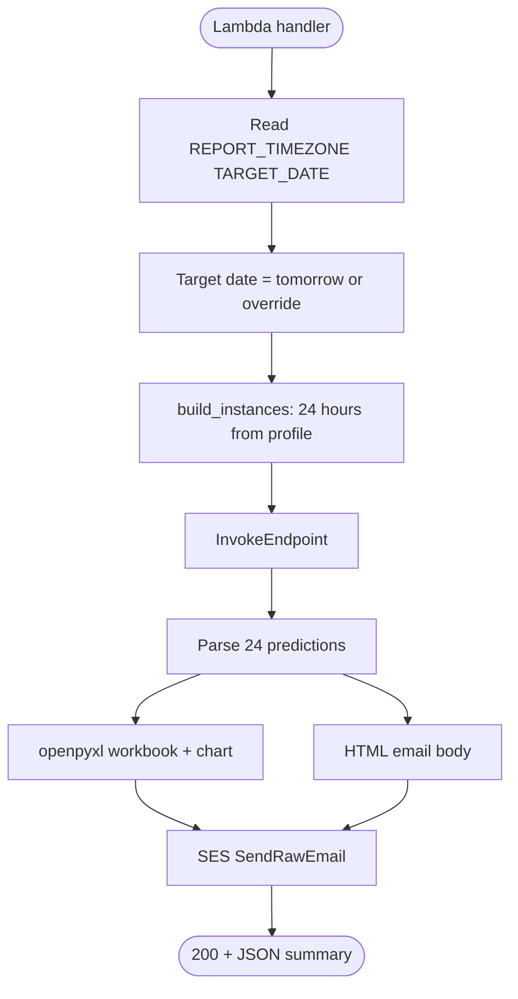

# Bike demand — architecture, flows, and documentation

This document describes **what the application does**, how **local development** and **AWS production** fit together, and includes **diagrams** you can render in GitHub, VS Code, or any Mermaid-compatible viewer.

**Microsoft Visio:** You can maintain parallel drawings (`.vsdx` / Visio for the web / SharePoint links) and wire them into this project via **[docs/diagrams/README.md](diagrams/README.md)** and **`visio_links.json`**. The CLI command `python pipeline.py diagram-links` prints those URLs for runbooks or automation.

**Related guides:** **[Exact target flow (start here)](FLOW_YOU_ARE_BUILDING.md)** · [README](../README.md) · [Diagrams hub (Visio)](diagrams/README.md) · [AWS daily report](AWS_DAILY_REPORT.md) · [Lambda step-by-step](LAMBDA_DAILY_REPORT_STEP_BY_STEP.md)

---

## 1. What the application does (in plain language)

The project predicts **hourly bike rental demand** (`cnt`) using the **UCI Bike Sharing** hourly dataset (`hour.csv`). It trains an **XGBoost regressor** on engineered features (time cycles, weather, calendar flags, interactions). The same feature pipeline is used for **training** and **inference**.

**Locally**, you can preprocess data, train, evaluate, compare models (linear regression, random forest, tuned RF, XGBoost), and run tests.

**On AWS**, you can:

1. Upload training data to **S3** and run a **SageMaker training job** (scikit-learn container with your `train.py`).
2. Deploy a **real-time SageMaker endpoint** that loads `model.joblib` and serves predictions via `inference.py`.
3. Run a **scheduled Lambda** (container image) that builds **24 scenario rows** for “tomorrow” (or a test date), calls the endpoint, builds an **Excel workbook** (table + pivot + chart), and emails it via **Amazon SES**.

The **daily report is a scenario forecast**: weather fields come from **median historical values by hour** (`hourly_profile.json`), not from a live weather API—unless you extend `handler.py` later.

---

## 2. Repository layout (mental map)

---

## 3. End-to-end AWS architecture

---

## 4. Local development pipeline (`pipeline.py`)

| Step | Command | Outcome |
|------|---------|---------|
| Preprocess | `python pipeline.py preprocess` | `data/processed/train.csv`, `test.csv` (time-based split) |
| Train locally | `python pipeline.py train-local` | `models/model.joblib` (+ legacy `xgb_bike_model.pkl`) |
| Evaluate | `python pipeline.py evaluate` | Metrics on holdout `test.csv` |
| Compare models | `python pipeline.py compare-models` | `models/compare_metrics.json` (LR, RF, tuned RF, XGB) |
| Cloud train | `python pipeline.py train-sagemaker` | Job on SageMaker; prints `MODEL_DATA_S3` |
| Deploy | `python deploy_endpoint.py --model-data s3://...` | Real-time endpoint; prints `ENDPOINT_NAME` |

---

## 5. Feature and training flow (ML detail)

**Training artifact:** A single `joblib` dict (or equivalent bundle) containing the **fitted XGBoost model**, **StandardScaler**, and **feature name list**. Inference uses `transform_raw_for_inference` so raw rows match training columns.

---

## 6. SageMaker training vs serving

**Serving contract (JSON):** Payload shape `{"instances": [ {...}, ... ] }` where each object has the **raw feature columns** expected by `input_fn` (including `dteday`, `season`, `yr`, `mnth`, `hr`, `holiday`, `weekday`, `workingday`, `weathersit`, `temp`, `atemp`, `hum`, `windspeed`). Response: `{"predictions": [...] }`.

---

## 7. Daily report Lambda flow

**Environment variables (Lambda):** `ENDPOINT_NAME`, `REPORT_EMAIL_FROM`, `REPORT_EMAIL_TO`, optional `REPORT_TIMEZONE`, `TARGET_DATE`, `ASSUME_HOLIDAY`, `ASSUME_YR`. See [AWS_DAILY_REPORT.md](AWS_DAILY_REPORT.md).

---

## 8. IAM and integration summary

| Component | Needs (typical) |
|-----------|-----------------|
| SageMaker training role | S3 read/write for channels and output; CloudWatch logs |
| SageMaker endpoint | Same model artifact access; runs inference container |
| Lambda execution role | `sagemaker:InvokeEndpoint` on the endpoint ARN; `ses:SendRawEmail`; CloudWatch Logs |
| EventBridge → Lambda | Scheduler role with `lambda:InvokeFunction` |
| Developer laptop | Credentials for training/deploy; SES test uses IAM user/role with `ses:SendRawEmail` |

Keep **one AWS Region** across SageMaker, SES identities, ECR, Lambda, and scheduler to avoid cross-region mistakes.

---

## 9. Operational notes

- **Regenerate weather profile:** After changing `data/raw/hour.csv`, run `python scripts/generate_hourly_profile.py`, then **rebuild and push** the Lambda image so `hourly_profile.json` updates inside the container.
- **Sandboxed SES:** Verify both sender and recipient (or move to production access).
- **Windows training logs:** Live CloudWatch log streaming during `train-sagemaker` may be disabled by default; see [README](../README.md) for `SAGEMAKER_FIT_LOGS` and UTF-8 console.

---

## 10. Document index

| Document | Purpose |
|----------|---------|
| [../README.md](../README.md) | Setup, commands, folder layout |
| [FLOW_YOU_ARE_BUILDING.md](FLOW_YOU_ARE_BUILDING.md) | **Exact phased flow** — local → SageMaker → daily email |
| [ARCHITECTURE_AND_FLOWS.md](ARCHITECTURE_AND_FLOWS.md) | This file — diagrams and system behavior |
| [diagrams/README.md](diagrams/README.md) | Visio / SharePoint links, `visio_links.json`, `diagram-links` CLI |
| [AWS_DAILY_REPORT.md](AWS_DAILY_REPORT.md) | Endpoint, SES, Lambda IAM, EventBridge reference |
| [LAMBDA_DAILY_REPORT_STEP_BY_STEP.md](LAMBDA_DAILY_REPORT_STEP_BY_STEP.md) | Beginner walkthrough: Docker, ECR, Lambda, schedule |

If you open this file in **GitHub** or use a **Mermaid preview** extension in VS Code/Cursor, the diagrams render automatically.
