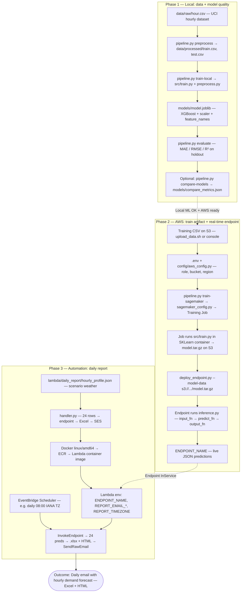
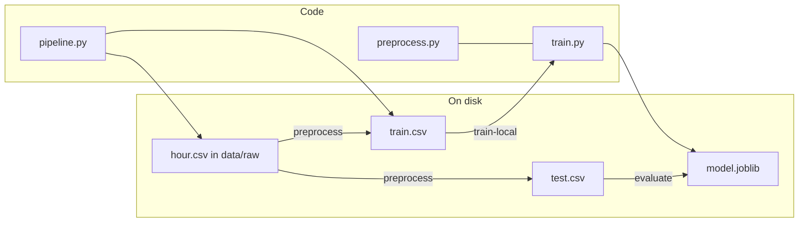
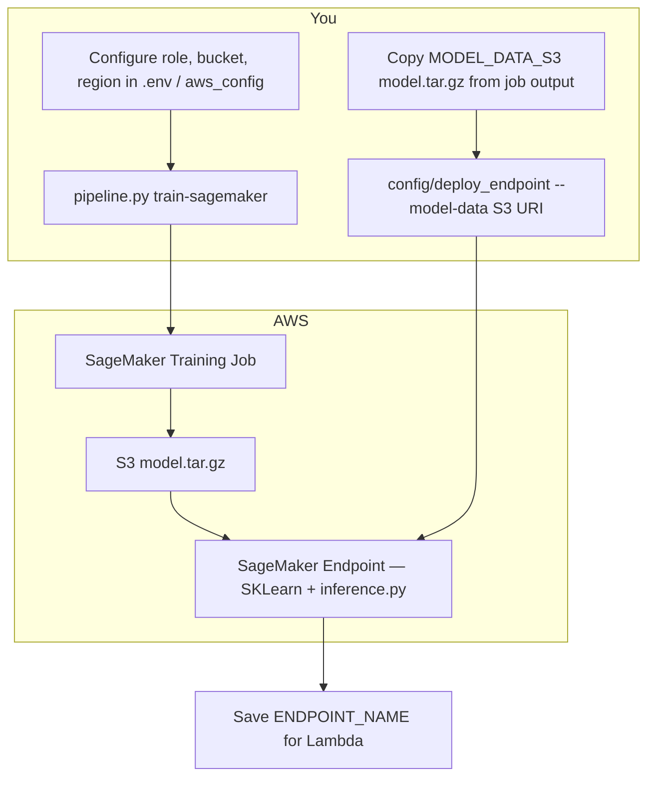
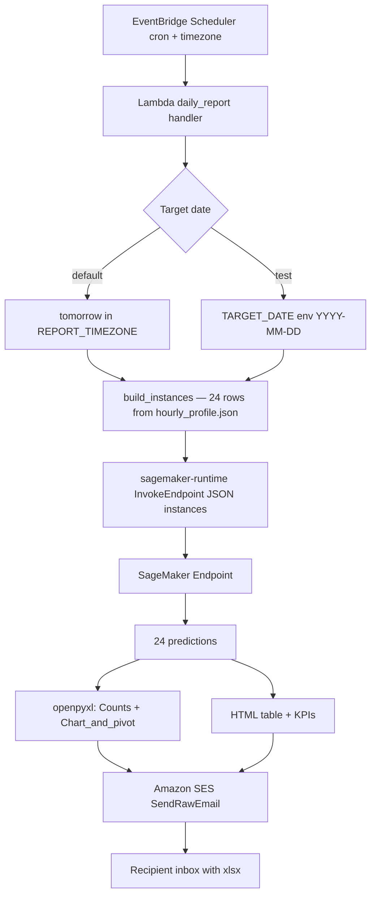
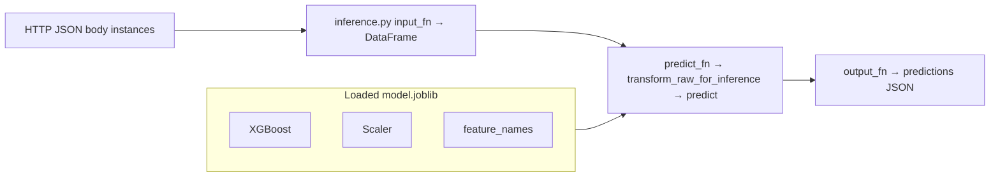

# Exact flow: what you are building

This page is the **single “goal diagram”** for this project: from **raw bike data** → **trained model** → **hosted predictions** → **scheduled daily email** with an Excel forecast. Open it in **GitHub**, **VS Code**, or **Cursor** with Mermaid preview so the drawings render.

**Companion:** [ARCHITECTURE_AND_FLOWS.md](ARCHITECTURE_AND_FLOWS.md) (full technical reference) · [README](../README.md)

---

## Your outcome in one sentence

**Train an XGBoost model on hourly bike rentals, deploy it on SageMaker, then every day automatically generate 24 hourly predictions for “tomorrow” (using a fixed weather scenario), attach an Excel report, and send it by email.**

---

## 1. Master flow (all three phases)

This diagram matches the **order you typically execute** work: prove it locally, then cloud train/deploy, then wire the daily Lambda.

**How to read the dashed arrows**

- Phase 1 → Phase 2: you move on **after** local preprocess/train/evaluate look good (and AWS config is ready).
- Phase 2 → Phase 3: Lambda needs a **working endpoint** (`ENDPOINT_NAME`).

---

## 2. Phase 1 only — local ML pipeline (exact files)

| Step | Command | Main outputs |
|------|---------|----------------|
| 1 | `python pipeline.py preprocess` | `train.csv`, `test.csv` |
| 2 | `python pipeline.py train-local` | `models/model.joblib` |
| 3 | `python pipeline.py evaluate` | Metrics JSON printed |
| 4 | `python pipeline.py compare-models` (optional) | `models/compare_metrics.json` |

---

## 3. Phase 2 only — from laptop to SageMaker endpoint

**Artifact path:** Training packages `model.joblib` inside `model.tar.gz`. Serving loads it in `inference.py` → `model_fn`.

---

## 4. Phase 3 only — one scheduled morning run (exact call chain)

**Inputs to the model in this phase:** Same column names as training raw rows (`dteday`, `season`, `yr`, `mnth`, `hr`, `holiday`, `weekday`, `workingday`, `weathersit`, `temp`, `atemp`, `hum`, `windspeed`). **`instant`** may be present; preprocessing drops leakage columns consistently.

---

## 5. Prediction path inside the endpoint (exact functions)

---

## 6. Checklist order (copy-paste sequence)

Use this as a **literal runbook**; details are in [README](../README.md), [AWS_DAILY_REPORT.md](AWS_DAILY_REPORT.md), and [LAMBDA_DAILY_REPORT_STEP_BY_STEP.md](LAMBDA_DAILY_REPORT_STEP_BY_STEP.md).

1. Put **`hour.csv`** in `sagemaker/data/raw/`.
2. **`python pipeline.py preprocess`** → **`train-local`** → **`evaluate`**.
3. Configure AWS **`.env`** (role, bucket, region).
4. Upload training data to **S3** if needed → **`python pipeline.py train-sagemaker`**.
5. **`python deploy_endpoint.py --model-data <MODEL_DATA_S3>`** → save **`ENDPOINT_NAME`**.
6. Verify **SES** identities → optional **`python scripts/send_ses_test_email.py`**.
7. Build/push **`lambda/daily_report`** image to **ECR**; create **Lambda** with env vars.
8. Create **EventBridge** schedule → target Lambda.
9. (Optional) Regenerate **`hourly_profile.json`** after data changes: **`python scripts/generate_hourly_profile.py`**, then rebuild the Lambda image.

---

## 7. Render these diagrams offline

- **In Cursor/VS Code:** install a “Mermaid” preview extension; open this `.md` file and preview.
- **In GitHub:** push the repo; GitHub renders Mermaid in markdown.
- **For PowerPoint/Visio:** use these diagrams as the **exact blueprint**—recreate the same boxes and arrows in your tool, or export PNG from a [Mermaid Live Editor](https://mermaid.live) by pasting a diagram’s code block.

If something in your real setup differs (e.g. different bucket layout), only the **S3 paths** and **names** change—the **phase order** stays the same.
